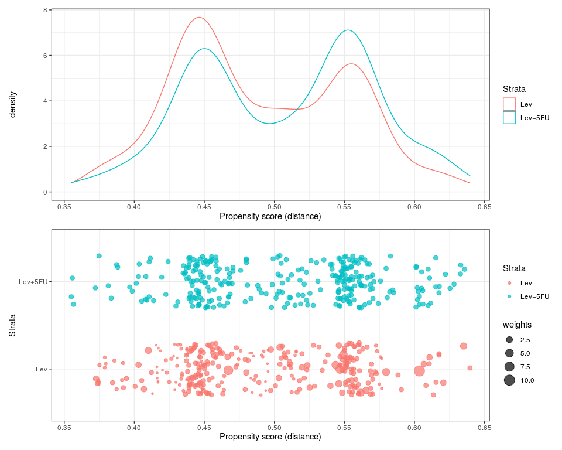

Propensity-score Matching (PSM) with the finalpsm package
=========================================================

Create the matching dataset
---------------------------

Firstly we should ensure all variables of interest are in the correct
formats for subsequent propensity-score matching. Variables should
either be factors or numerical as appropriate.

We will be using the `survival::colon` dataset as the basis of our
example.

    data <- tibble::as_tibble(survival::colon) %>%
      
      dplyr::filter(etype==2) %>% # Outcome of interest is death
      dplyr::filter(rx!="Obs") %>%  # rx will be our binary treatment variable
      dplyr::select(-etype,-study, -status) %>% # Remove superfluous variables
      
      # Convert into numeric and factor variables
      dplyr::mutate_at(vars(obstruct, perfor, adhere, node4), function(x){factor(x, levels=c(0,1), labels = c("No", "Yes"))}) %>%
      dplyr::mutate(rx = factor(rx),
                    mort365 = cut(time, breaks = c(-Inf, 365, Inf), labels = c("Yes", "No")),
                    sex = factor(sex, levels=c(0,1), labels = c("Female", "Male")),
                    differ = factor(differ, levels = c(1,2,3), labels = c("Well", "Moderate", "Poor")),
                    extent = factor(extent, levels = c(1,2,3, 4), labels = c("Submucosa", "Muscle", "Serosa", "Contiguous Structures")),
                    surg = factor(surg, levels = c(0,1), labels = c("Short", "Long"))) %>%
      
      # Logical value for outcome (for survival analysis)
      dplyr::mutate(status = mort365=="Yes")

    knitr::kable(head(data, 10))

<table>
<colgroup>
<col style="width: 3%" />
<col style="width: 8%" />
<col style="width: 7%" />
<col style="width: 4%" />
<col style="width: 9%" />
<col style="width: 7%" />
<col style="width: 7%" />
<col style="width: 6%" />
<col style="width: 9%" />
<col style="width: 7%" />
<col style="width: 6%" />
<col style="width: 6%" />
<col style="width: 5%" />
<col style="width: 8%" />
<col style="width: 7%" />
</colgroup>
<thead>
<tr class="header">
<th style="text-align: right;">id</th>
<th style="text-align: left;">rx</th>
<th style="text-align: left;">sex</th>
<th style="text-align: right;">age</th>
<th style="text-align: left;">obstruct</th>
<th style="text-align: left;">perfor</th>
<th style="text-align: left;">adhere</th>
<th style="text-align: right;">nodes</th>
<th style="text-align: left;">differ</th>
<th style="text-align: left;">extent</th>
<th style="text-align: left;">surg</th>
<th style="text-align: left;">node4</th>
<th style="text-align: right;">time</th>
<th style="text-align: left;">mort365</th>
<th style="text-align: left;">status</th>
</tr>
</thead>
<tbody>
<tr class="odd">
<td style="text-align: right;">1</td>
<td style="text-align: left;">Lev+5FU</td>
<td style="text-align: left;">Male</td>
<td style="text-align: right;">43</td>
<td style="text-align: left;">No</td>
<td style="text-align: left;">No</td>
<td style="text-align: left;">No</td>
<td style="text-align: right;">5</td>
<td style="text-align: left;">Moderate</td>
<td style="text-align: left;">Serosa</td>
<td style="text-align: left;">Short</td>
<td style="text-align: left;">Yes</td>
<td style="text-align: right;">1521</td>
<td style="text-align: left;">No</td>
<td style="text-align: left;">FALSE</td>
</tr>
<tr class="even">
<td style="text-align: right;">2</td>
<td style="text-align: left;">Lev+5FU</td>
<td style="text-align: left;">Male</td>
<td style="text-align: right;">63</td>
<td style="text-align: left;">No</td>
<td style="text-align: left;">No</td>
<td style="text-align: left;">No</td>
<td style="text-align: right;">1</td>
<td style="text-align: left;">Moderate</td>
<td style="text-align: left;">Serosa</td>
<td style="text-align: left;">Short</td>
<td style="text-align: left;">No</td>
<td style="text-align: right;">3087</td>
<td style="text-align: left;">No</td>
<td style="text-align: left;">FALSE</td>
</tr>
<tr class="odd">
<td style="text-align: right;">4</td>
<td style="text-align: left;">Lev+5FU</td>
<td style="text-align: left;">Female</td>
<td style="text-align: right;">66</td>
<td style="text-align: left;">Yes</td>
<td style="text-align: left;">No</td>
<td style="text-align: left;">No</td>
<td style="text-align: right;">6</td>
<td style="text-align: left;">Moderate</td>
<td style="text-align: left;">Serosa</td>
<td style="text-align: left;">Long</td>
<td style="text-align: left;">Yes</td>
<td style="text-align: right;">293</td>
<td style="text-align: left;">Yes</td>
<td style="text-align: left;">TRUE</td>
</tr>
<tr class="even">
<td style="text-align: right;">6</td>
<td style="text-align: left;">Lev+5FU</td>
<td style="text-align: left;">Female</td>
<td style="text-align: right;">57</td>
<td style="text-align: left;">No</td>
<td style="text-align: left;">No</td>
<td style="text-align: left;">No</td>
<td style="text-align: right;">9</td>
<td style="text-align: left;">Moderate</td>
<td style="text-align: left;">Serosa</td>
<td style="text-align: left;">Short</td>
<td style="text-align: left;">Yes</td>
<td style="text-align: right;">1767</td>
<td style="text-align: left;">No</td>
<td style="text-align: left;">FALSE</td>
</tr>
<tr class="odd">
<td style="text-align: right;">7</td>
<td style="text-align: left;">Lev</td>
<td style="text-align: left;">Male</td>
<td style="text-align: right;">77</td>
<td style="text-align: left;">No</td>
<td style="text-align: left;">No</td>
<td style="text-align: left;">No</td>
<td style="text-align: right;">5</td>
<td style="text-align: left;">Moderate</td>
<td style="text-align: left;">Serosa</td>
<td style="text-align: left;">Long</td>
<td style="text-align: left;">Yes</td>
<td style="text-align: right;">420</td>
<td style="text-align: left;">No</td>
<td style="text-align: left;">FALSE</td>
</tr>
<tr class="even">
<td style="text-align: right;">9</td>
<td style="text-align: left;">Lev</td>
<td style="text-align: left;">Male</td>
<td style="text-align: right;">46</td>
<td style="text-align: left;">No</td>
<td style="text-align: left;">No</td>
<td style="text-align: left;">Yes</td>
<td style="text-align: right;">2</td>
<td style="text-align: left;">Moderate</td>
<td style="text-align: left;">Serosa</td>
<td style="text-align: left;">Short</td>
<td style="text-align: left;">No</td>
<td style="text-align: right;">3173</td>
<td style="text-align: left;">No</td>
<td style="text-align: left;">FALSE</td>
</tr>
<tr class="odd">
<td style="text-align: right;">10</td>
<td style="text-align: left;">Lev+5FU</td>
<td style="text-align: left;">Female</td>
<td style="text-align: right;">68</td>
<td style="text-align: left;">No</td>
<td style="text-align: left;">No</td>
<td style="text-align: left;">No</td>
<td style="text-align: right;">1</td>
<td style="text-align: left;">Moderate</td>
<td style="text-align: left;">Serosa</td>
<td style="text-align: left;">Long</td>
<td style="text-align: left;">No</td>
<td style="text-align: right;">3308</td>
<td style="text-align: left;">No</td>
<td style="text-align: left;">FALSE</td>
</tr>
<tr class="even">
<td style="text-align: right;">11</td>
<td style="text-align: left;">Lev</td>
<td style="text-align: left;">Female</td>
<td style="text-align: right;">47</td>
<td style="text-align: left;">No</td>
<td style="text-align: left;">No</td>
<td style="text-align: left;">Yes</td>
<td style="text-align: right;">1</td>
<td style="text-align: left;">Moderate</td>
<td style="text-align: left;">Serosa</td>
<td style="text-align: left;">Short</td>
<td style="text-align: left;">No</td>
<td style="text-align: right;">2908</td>
<td style="text-align: left;">No</td>
<td style="text-align: left;">FALSE</td>
</tr>
<tr class="odd">
<td style="text-align: right;">12</td>
<td style="text-align: left;">Lev+5FU</td>
<td style="text-align: left;">Male</td>
<td style="text-align: right;">52</td>
<td style="text-align: left;">No</td>
<td style="text-align: left;">No</td>
<td style="text-align: left;">No</td>
<td style="text-align: right;">2</td>
<td style="text-align: left;">Poor</td>
<td style="text-align: left;">Serosa</td>
<td style="text-align: left;">Long</td>
<td style="text-align: left;">No</td>
<td style="text-align: right;">3309</td>
<td style="text-align: left;">No</td>
<td style="text-align: left;">FALSE</td>
</tr>
<tr class="even">
<td style="text-align: right;">14</td>
<td style="text-align: left;">Lev</td>
<td style="text-align: left;">Male</td>
<td style="text-align: right;">68</td>
<td style="text-align: left;">Yes</td>
<td style="text-align: left;">No</td>
<td style="text-align: left;">No</td>
<td style="text-align: right;">3</td>
<td style="text-align: left;">Moderate</td>
<td style="text-align: left;">Serosa</td>
<td style="text-align: left;">Short</td>
<td style="text-align: left;">No</td>
<td style="text-align: right;">2910</td>
<td style="text-align: left;">No</td>
<td style="text-align: left;">FALSE</td>
</tr>
</tbody>
</table>

   

Propensity-score matching with matchit
--------------------------------------

With the data pre-processed, we can use the finalpsm `matchit()`
function to create the PSM dataset. This is essentially a wrapper
function to the MatchIt `matchit()` function - one of the most widely
used packages for PSM within R. However, the finalpsm `matchit()`
addresses what are felt to be several key issues:

-   Issue: The `MatchIt::matchit()` does not easily fit into a tidyverse
    workflow.

-   Solution: Inspired by the tidyverse and finalfit, the `matchit()`
    function facilitates a modulator approach to building formulae.

 

-   Problem: The `MatchIt::matchit()` will not run if there is missing
    data present in the strata or explanatory variables.

-   Solution: The `matchit()` function performs pairwise deletion *only*
    on those the strata or explanatory variables

 

-   Problem: The `MatchIt::matchit()` will not run if the `strata`
    variable is not a numeric binary variable (0 or 1).

-   Solution: The `matchit()` function handles the `strata` variable
    internally to allow either a factor or numeric variable to be used.
    The lowest value or first level will be designed the control (0),
    and the highest value or second level will be designated the
    treatment (1).

   

There are 4 types of variables that can be specified in the
`finalpsm::match` function:

-   `strata` - The binary treatment variable

-   `explanatory` - All variables that are desired to be used to
    generate the propensity-score.

-   `id` - An optional variable that allows any number of columns that
    provide a method of identifying the patient to be retained (e.g. the
    record or hospital id for each patient). This is **not** used in the
    propensity-score matching process.

-   `dependent`- An optional variable that allows any number of columns
    that contain the desired outcome(s) of the patient that will be used
    within the subsequent modeling. This is **not** used in the
    propensity-score matching process.

All other inputs to the `MatchIt::matchit()` are accepted (see [MatchIt
documentation](https://cran.r-project.org/web/packages/MatchIt/MatchIt.pdf))
with the default method of matching being full matching.

 

 

The outputs from the `finalpsm::match()` function include:

-   1.  `object`: This can be used as like any `MatchIt::matchit()`
        output and so facilitates its use within existing scripts
        (although this function is designed with the intention to be
        used with subsequently described functions).

<!-- -->

    output$object

    ## 
    ## Call: 
    ## MatchIt::matchit(formula = rx_01 ~ age + sex + obstruct + differ + 
    ##     surg, data = data_match, method = method)
    ## 
    ## Sample sizes:
    ##           Control Treated
    ## All           300     298
    ## Matched       300     298
    ## Discarded       0       0

-   1.  `data`: This is the final matched dataset. However, this is not
        just the output from `MatchIt::match.data()` applied to the
        `MatchIt::matchit()` object, but also all specified variables
        under the `dependent` or `id` parameters. Unspecified variables
        are removed.

-   **Note**: *If the `keep_all` argument is set to TRUE, this retains
    all columns in the original dataset (and so removes the need for
    specifying dependent or id variables)*.

<!-- -->

    head(output$data, 10) %>% knitr::kable()

<table style="width:100%;">
<colgroup>
<col style="width: 5%" />
<col style="width: 2%" />
<col style="width: 7%" />
<col style="width: 5%" />
<col style="width: 3%" />
<col style="width: 6%" />
<col style="width: 8%" />
<col style="width: 8%" />
<col style="width: 5%" />
<col style="width: 9%" />
<col style="width: 9%" />
<col style="width: 8%" />
<col style="width: 7%" />
<col style="width: 7%" />
<col style="width: 4%" />
</colgroup>
<thead>
<tr class="header">
<th style="text-align: right;">rowid</th>
<th style="text-align: right;">id</th>
<th style="text-align: left;">rx</th>
<th style="text-align: right;">rx_01</th>
<th style="text-align: right;">age</th>
<th style="text-align: left;">sex</th>
<th style="text-align: left;">obstruct</th>
<th style="text-align: left;">differ</th>
<th style="text-align: left;">surg</th>
<th style="text-align: right;">distance</th>
<th style="text-align: right;">weights</th>
<th style="text-align: right;">subclass</th>
<th style="text-align: left;">match</th>
<th style="text-align: left;">mort365</th>
<th style="text-align: right;">time</th>
</tr>
</thead>
<tbody>
<tr class="odd">
<td style="text-align: right;">1</td>
<td style="text-align: right;">1</td>
<td style="text-align: left;">Lev+5FU</td>
<td style="text-align: right;">1</td>
<td style="text-align: right;">43</td>
<td style="text-align: left;">Male</td>
<td style="text-align: left;">No</td>
<td style="text-align: left;">Moderate</td>
<td style="text-align: left;">Short</td>
<td style="text-align: right;">0.4639307</td>
<td style="text-align: right;">1.0000000</td>
<td style="text-align: right;">1</td>
<td style="text-align: left;">Matched</td>
<td style="text-align: left;">No</td>
<td style="text-align: right;">1521</td>
</tr>
<tr class="even">
<td style="text-align: right;">2</td>
<td style="text-align: right;">2</td>
<td style="text-align: left;">Lev+5FU</td>
<td style="text-align: right;">1</td>
<td style="text-align: right;">63</td>
<td style="text-align: left;">Male</td>
<td style="text-align: left;">No</td>
<td style="text-align: left;">Moderate</td>
<td style="text-align: left;">Short</td>
<td style="text-align: right;">0.4477382</td>
<td style="text-align: right;">1.0000000</td>
<td style="text-align: right;">198</td>
<td style="text-align: left;">Matched</td>
<td style="text-align: left;">No</td>
<td style="text-align: right;">3087</td>
</tr>
<tr class="odd">
<td style="text-align: right;">3</td>
<td style="text-align: right;">4</td>
<td style="text-align: left;">Lev+5FU</td>
<td style="text-align: right;">1</td>
<td style="text-align: right;">66</td>
<td style="text-align: left;">Female</td>
<td style="text-align: left;">Yes</td>
<td style="text-align: left;">Moderate</td>
<td style="text-align: left;">Long</td>
<td style="text-align: right;">0.5182585</td>
<td style="text-align: right;">1.0000000</td>
<td style="text-align: right;">11</td>
<td style="text-align: left;">Matched</td>
<td style="text-align: left;">Yes</td>
<td style="text-align: right;">293</td>
</tr>
<tr class="even">
<td style="text-align: right;">4</td>
<td style="text-align: right;">6</td>
<td style="text-align: left;">Lev+5FU</td>
<td style="text-align: right;">1</td>
<td style="text-align: right;">57</td>
<td style="text-align: left;">Female</td>
<td style="text-align: left;">No</td>
<td style="text-align: left;">Moderate</td>
<td style="text-align: left;">Short</td>
<td style="text-align: right;">0.5605443</td>
<td style="text-align: right;">1.0000000</td>
<td style="text-align: right;">63</td>
<td style="text-align: left;">Matched</td>
<td style="text-align: left;">No</td>
<td style="text-align: right;">1767</td>
</tr>
<tr class="odd">
<td style="text-align: right;">5</td>
<td style="text-align: right;">7</td>
<td style="text-align: left;">Lev</td>
<td style="text-align: right;">0</td>
<td style="text-align: right;">77</td>
<td style="text-align: left;">Male</td>
<td style="text-align: left;">No</td>
<td style="text-align: left;">Moderate</td>
<td style="text-align: left;">Long</td>
<td style="text-align: right;">0.4334800</td>
<td style="text-align: right;">0.3355705</td>
<td style="text-align: right;">227</td>
<td style="text-align: left;">Matched</td>
<td style="text-align: left;">No</td>
<td style="text-align: right;">420</td>
</tr>
<tr class="even">
<td style="text-align: right;">6</td>
<td style="text-align: right;">9</td>
<td style="text-align: left;">Lev</td>
<td style="text-align: right;">0</td>
<td style="text-align: right;">46</td>
<td style="text-align: left;">Male</td>
<td style="text-align: left;">No</td>
<td style="text-align: left;">Moderate</td>
<td style="text-align: left;">Short</td>
<td style="text-align: right;">0.4614961</td>
<td style="text-align: right;">1.0067114</td>
<td style="text-align: right;">76</td>
<td style="text-align: left;">Matched</td>
<td style="text-align: left;">No</td>
<td style="text-align: right;">3173</td>
</tr>
<tr class="odd">
<td style="text-align: right;">7</td>
<td style="text-align: right;">10</td>
<td style="text-align: left;">Lev+5FU</td>
<td style="text-align: right;">1</td>
<td style="text-align: right;">68</td>
<td style="text-align: left;">Female</td>
<td style="text-align: left;">No</td>
<td style="text-align: left;">Moderate</td>
<td style="text-align: left;">Long</td>
<td style="text-align: right;">0.5486730</td>
<td style="text-align: right;">1.0000000</td>
<td style="text-align: right;">150</td>
<td style="text-align: left;">Matched</td>
<td style="text-align: left;">No</td>
<td style="text-align: right;">3308</td>
</tr>
<tr class="even">
<td style="text-align: right;">8</td>
<td style="text-align: right;">11</td>
<td style="text-align: left;">Lev</td>
<td style="text-align: right;">0</td>
<td style="text-align: right;">47</td>
<td style="text-align: left;">Female</td>
<td style="text-align: left;">No</td>
<td style="text-align: left;">Moderate</td>
<td style="text-align: left;">Short</td>
<td style="text-align: right;">0.5685687</td>
<td style="text-align: right;">1.0067114</td>
<td style="text-align: right;">204</td>
<td style="text-align: left;">Matched</td>
<td style="text-align: left;">No</td>
<td style="text-align: right;">2908</td>
</tr>
<tr class="odd">
<td style="text-align: right;">9</td>
<td style="text-align: right;">12</td>
<td style="text-align: left;">Lev+5FU</td>
<td style="text-align: right;">1</td>
<td style="text-align: right;">52</td>
<td style="text-align: left;">Male</td>
<td style="text-align: left;">No</td>
<td style="text-align: left;">Poor</td>
<td style="text-align: left;">Long</td>
<td style="text-align: right;">0.5115592</td>
<td style="text-align: right;">1.0000000</td>
<td style="text-align: right;">163</td>
<td style="text-align: left;">Matched</td>
<td style="text-align: left;">No</td>
<td style="text-align: right;">3309</td>
</tr>
<tr class="even">
<td style="text-align: right;">10</td>
<td style="text-align: right;">14</td>
<td style="text-align: left;">Lev</td>
<td style="text-align: right;">0</td>
<td style="text-align: right;">68</td>
<td style="text-align: left;">Male</td>
<td style="text-align: left;">Yes</td>
<td style="text-align: left;">Moderate</td>
<td style="text-align: left;">Short</td>
<td style="text-align: right;">0.4121929</td>
<td style="text-align: right;">1.0067114</td>
<td style="text-align: right;">139</td>
<td style="text-align: left;">Matched</td>
<td style="text-align: left;">No</td>
<td style="text-align: right;">2910</td>
</tr>
</tbody>
</table>

 

There are 3 additional columns appended to the dataset following
propensity-score matching:

-   `distance`: This is the propensity-score generated for that record.
    This is the probability of that patient being in the treatment group
    (`strata`), given the covariates supplied (`explanatory`).

-   `weights`: This is the weighting provided to each patient within the
    matching procedure (particularly relevant in full matching). As
    stated by the MatchIt authors ([Ho et
    al.](https://r.iq.harvard.edu/docs/matchit/2.4-20/matchit.pdf)):
    “*If one chooses options that allow matching with replacement, or
    any solution that has different numbers of controls (or treateds)
    within each subclass or strata (such as full matching), then the
    parametric analysis following matching must accomodate these
    procedures*”. As such, the `weights` column is used within
    subsequent modeling to ensure that the dataset remains balanced on
    the key variables.

-   `subclass`: This is which subclass (aka block) the patient has been
    divided into based on their propensity score. Within each of the
    subclasses the propensity score is, at least approximately,
    constant. This is only present with full or sub-classification
    propensity score matching.

   

Assessment of Balance
---------------------

So we have gone to the effort of matching the sample to allow inference.
However, before we start using the matched dataset generated, we should
ensure that the PSM process has achieved its goal of creating a balanced
sample on our observed variables (as that is a key determinant of the
validity of any conclusions based on this data).

This can be achieved in 2 ways: both visual and quantitative methods of
assessing balance.

 

### Balance Visualisation

There are several ways to visualise balance after PSM, which broadly
fall into 2 categories: overall assessment and individual covariate
assessment (`explanatory`).

The `balance_plot()` function provides the capability to easily generate
several ggplots to allow quick assessment.

-   All plots only require the object produced by `matchit`.

-   All plots produced are relatively plain, but can be aesthetically
    modified further via ggplot2 functions.

 

#### 1. Overall balance between treatment groups

This can be visualised as a density or jitter plot to allow comparison
of the overall distribution of propensity-scores between the treatment
groups.

    finalpsm::balance_plot(output, type = "density") / finalpsm::balance_plot(output, type = "jitter")

Well balanced groups should follow approximately the same pattern (as in
this case).

 

#### 2. Covariate balance between treatment groups

This can be visualised as a geom\_point plot with a line of best fit to
allow comparison of the distribution of propensity-scores between
treatment groups for the different covariates (`explanatory` variables).

    # https://sejdemyr.github.io/r-tutorials/statistics/tutorial8.html
    covariate <- finalpsm::balance_plot(output, type = "covariate")

    covariate$factor / covariate$numeric

Well balanced groups should follow approximately the same pattern (as in
this case).

This can also be visualized as a [Love
plot](https://www.lexjansen.com/pharmasug/2007/pr/PR02.pdf) graphically
displaying covariate balance before and after adjusting.

-   An absolute SMD of 0 is complete balance. This plot requires a
    decision regarding the threshold of what is considered “balanced”
    within the dataset (e.g. the accepted standardised mean difference
    (SMD) between the treatment and control groups for each variable).
    The default is an absolute SMD of 0.2, below which the variables are
    considered well balanced.

-   The arrow starts at the unmatched absolute SMD for that variable,
    and points to the absolute SMD following propensity score matching.

<!-- -->

    # https://sejdemyr.github.io/r-tutorials/statistics/tutorial8.html
    finalpsm::balance_plot(output, type = "love", threshold = 0.2)

From the Love plot here, we can see that while some variables have
become less balanced as a result of the propensity score matching
process, these remain overall within our stated threshold of “good”
balance (0.2). The unbalanced variable (sex) has seen a substantial
improvement in balance as a result of the PSM process.

 

#### Balance Table

However, people usually like some objective numbers thrown in (even if
it’s sometimes about as arbitrary as squinting at a plot).

There are several packages out there that include some measure of formal
quantification of the balance in a PSM sample (“balance tables”),
`MatchIt` included. However, these tend to be poorly formatted for
readability, comparison and publication.

The [`cobalt`
package](https://cran.r-project.org/web/packages/cobalt/vignettes/cobalt_A0_basic_use.html)
is far more sophisticated regarding assessment of balance than
`finalpsm`, however does not work well within the intended `tidyverse` /
`finalfit` workflow to produce tables formatted for publication.

    finalpsm::balance_table(output, threshold = 0.2) %>% knitr::kable()

<table style="width:100%;">
<colgroup>
<col style="width: 8%" />
<col style="width: 8%" />
<col style="width: 11%" />
<col style="width: 11%" />
<col style="width: 7%" />
<col style="width: 11%" />
<col style="width: 11%" />
<col style="width: 11%" />
<col style="width: 7%" />
<col style="width: 11%" />
</colgroup>
<thead>
<tr class="header">
<th style="text-align: left;">label</th>
<th style="text-align: left;">level</th>
<th style="text-align: left;">unm_con</th>
<th style="text-align: left;">unm_trt</th>
<th style="text-align: left;">unm_smd</th>
<th style="text-align: left;">unm_balance</th>
<th style="text-align: left;">mat_con</th>
<th style="text-align: left;">mat_trt</th>
<th style="text-align: left;">mat_smd</th>
<th style="text-align: left;">mat_balance</th>
</tr>
</thead>
<tbody>
<tr class="odd">
<td style="text-align: left;">age</td>
<td style="text-align: left;">(SD)</td>
<td style="text-align: left;">60.2 (11.7)</td>
<td style="text-align: left;">59.7 (12.3)</td>
<td style="text-align: left;">0.037</td>
<td style="text-align: left;">Yes</td>
<td style="text-align: left;">60.2 (12.3)</td>
<td style="text-align: left;">59.7 (12.3)</td>
<td style="text-align: left;">0.011</td>
<td style="text-align: left;">Yes</td>
</tr>
<tr class="even">
<td style="text-align: left;">sex</td>
<td style="text-align: left;">Female</td>
<td style="text-align: left;">131 (43.7)</td>
<td style="text-align: left;">161 (54.0)</td>
<td style="text-align: left;">0.208</td>
<td style="text-align: left;">No</td>
<td style="text-align: left;">157 (52.3)</td>
<td style="text-align: left;">161 (54.0)</td>
<td style="text-align: left;">0.034</td>
<td style="text-align: left;">Yes</td>
</tr>
<tr class="odd">
<td style="text-align: left;"></td>
<td style="text-align: left;">Male</td>
<td style="text-align: left;">169 (56.3)</td>
<td style="text-align: left;">137 (46.0)</td>
<td style="text-align: left;"></td>
<td style="text-align: left;"></td>
<td style="text-align: left;">143 (47.7)</td>
<td style="text-align: left;">137 (46.0)</td>
<td style="text-align: left;"></td>
<td style="text-align: left;"></td>
</tr>
<tr class="even">
<td style="text-align: left;">obstruct</td>
<td style="text-align: left;">No</td>
<td style="text-align: left;">241 (80.3)</td>
<td style="text-align: left;">244 (81.9)</td>
<td style="text-align: left;">0.039</td>
<td style="text-align: left;">Yes</td>
<td style="text-align: left;">257 (85.7)</td>
<td style="text-align: left;">244 (81.9)</td>
<td style="text-align: left;">0.103</td>
<td style="text-align: left;">Yes</td>
</tr>
<tr class="odd">
<td style="text-align: left;"></td>
<td style="text-align: left;">Yes</td>
<td style="text-align: left;">59 (19.7)</td>
<td style="text-align: left;">54 (18.1)</td>
<td style="text-align: left;"></td>
<td style="text-align: left;"></td>
<td style="text-align: left;">43 (14.3)</td>
<td style="text-align: left;">54 (18.1)</td>
<td style="text-align: left;"></td>
<td style="text-align: left;"></td>
</tr>
<tr class="even">
<td style="text-align: left;">differ</td>
<td style="text-align: left;">Well</td>
<td style="text-align: left;">37 (12.3)</td>
<td style="text-align: left;">29 (9.7)</td>
<td style="text-align: left;">0.116</td>
<td style="text-align: left;">Yes</td>
<td style="text-align: left;">26 (8.7)</td>
<td style="text-align: left;">29 (9.7)</td>
<td style="text-align: left;">0.038</td>
<td style="text-align: left;">Yes</td>
</tr>
<tr class="odd">
<td style="text-align: left;"></td>
<td style="text-align: left;">Moderate</td>
<td style="text-align: left;">219 (73.0)</td>
<td style="text-align: left;">215 (72.1)</td>
<td style="text-align: left;"></td>
<td style="text-align: left;"></td>
<td style="text-align: left;">218 (72.7)</td>
<td style="text-align: left;">215 (72.1)</td>
<td style="text-align: left;"></td>
<td style="text-align: left;"></td>
</tr>
<tr class="even">
<td style="text-align: left;"></td>
<td style="text-align: left;">Poor</td>
<td style="text-align: left;">44 (14.7)</td>
<td style="text-align: left;">54 (18.1)</td>
<td style="text-align: left;"></td>
<td style="text-align: left;"></td>
<td style="text-align: left;">56 (18.7)</td>
<td style="text-align: left;">54 (18.1)</td>
<td style="text-align: left;"></td>
<td style="text-align: left;"></td>
</tr>
<tr class="odd">
<td style="text-align: left;">surg</td>
<td style="text-align: left;">Short</td>
<td style="text-align: left;">222 (74.0)</td>
<td style="text-align: left;">222 (74.5)</td>
<td style="text-align: left;">0.011</td>
<td style="text-align: left;">Yes</td>
<td style="text-align: left;">234 (78.0)</td>
<td style="text-align: left;">222 (74.5)</td>
<td style="text-align: left;">0.082</td>
<td style="text-align: left;">Yes</td>
</tr>
<tr class="even">
<td style="text-align: left;"></td>
<td style="text-align: left;">Long</td>
<td style="text-align: left;">78 (26.0)</td>
<td style="text-align: left;">76 (25.5)</td>
<td style="text-align: left;"></td>
<td style="text-align: left;"></td>
<td style="text-align: left;">66 (22.0)</td>
<td style="text-align: left;">76 (25.5)</td>
<td style="text-align: left;"></td>
<td style="text-align: left;"></td>
</tr>
</tbody>
</table>

As you can see with the `unm_balance` and `mat_balance` columns, the
sample is already relatively well balanced in the “unmatched” sample
(`unm_`) with in imbalance in the sex variable (more females in the
treated group). However, in the propensity-score matched sample, a much
improved balance has been achieved across all variables (all now below
the a priori absolute standardised mean difference of 0.2).

-   **Note**: *There is recognise concerns regarding the use of
    significant tests to determine differences in treatment groups as a
    method of assessing balance with propensity score matching [Imai et
    al. (2008)](https://doi.org/10.1111/j.1467-985X.2007.00527.x). As
    such, this is not automatically provided, but can be included if
    desired if `p=TRUE` argument is added*.
